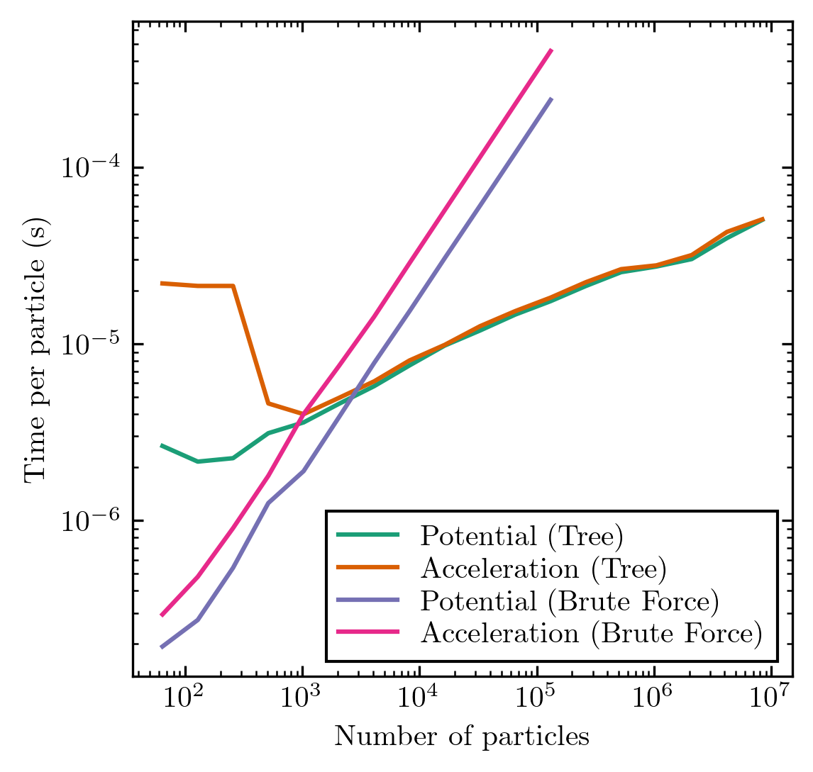

# Introduction
pytreegrav is a package for computing the gravitational potential and/or field of a set of particles. It includes methods for brute-force direction summation and for the fast, approximate Barnes-Hut treecode method. For the Barnes-Hut method we implement an oct-tree as a numba jitclass to achieve much higher peformance than the equivalent pure Python implementation, without writing a single line of C or Cython. Full documentation is available [here](http://pytreegrav.readthedocs.io).

# Installation

```pip install pytreegrav``` or clone the repo and run ```python setup.py install``` from the repo directory.

# Walkthrough
First let's import the stuff we want and generate some particle positions and masses - these would be your particle data for whatever your problem is.


```python
import numpy as np
from pytreegrav import Accel, Potential
```


```python
N = 10**5 # number of particles
x = np.random.rand(N,3) # positions randomly sampled in the unit cube
m = np.repeat(1./N,N) # masses - let the system have unit mass
h = np.repeat(0.01,N) # softening radii - these are optional, assumed 0 if not provided to the frontend functions
```

Now we can use the ``Accel`` and ``Potential`` functions to compute the gravitational field and potential at each particle position:


```python
print(Accel(x,m,h))
print(Potential(x,m,h))
```

    [[-0.1521787   0.2958852  -0.30109005]
     [-0.50678204 -0.37489886 -1.0558666 ]
     [-0.24650087  0.95423467 -0.175074  ]
     ...
     [ 0.87868472 -1.28332176 -0.22718531]
     [-0.41962742  0.32372245 -1.31829084]
     [ 2.45127054  0.38292881  0.05820412]]
    [-2.35518057 -2.19299372 -2.28494218 ... -2.11783337 -2.1653377
     -1.80464695]


By default, pytreegrav will try to make the optimal choice between brute-force and tree methods for speed, but we can also force it to use one method or another. Let's try both and compare their runtimes:


```python
from time import time
t = time()
# tree gravitational acceleration
accel_tree = Accel(x,m,h,method='tree')
print("Tree accel runtime: %gs"%(time() - t)); t = time()

accel_bruteforce = Accel(x,m,h,method='bruteforce')
print("Brute force accel runtime: %gs"%(time() - t)); t = time()

phi_tree = Potential(x,m,h,method='tree')
print("Tree potential runtime: %gs"%(time() - t)); t = time()

phi_bruteforce = Potential(x,m,h,method='bruteforce')
print("Brute force potential runtime: %gs"%(time() - t)); t = time()
```

    Tree accel runtime: 0.927745s
    Brute force accel runtime: 44.1175s
    Tree potential runtime: 0.802386s
    Brute force potential runtime: 20.0234s


As you can see, the tree-based methods can be much faster than the brute-force methods, especially for particle counts exceeding 10^4. Here's an example of how much faster the treecode is when run on a Plummer sphere with a variable number of particles, on a single core of an Intel i9 9900k workstation:



But there's no free lunch here: the tree methods are approximate. Let's quantify the RMS errors of the stuff we just computed, compared to the exact brute-force solutions:


```python
acc_error = np.sqrt(np.mean(np.sum((accel_tree-accel_bruteforce)**2,axis=1))) # RMS force error
print("RMS force error: ", acc_error)
phi_error = np.std(phi_tree - phi_bruteforce)
print("RMS potential error: ", phi_error)
```

    RMS force error:  0.006739311224338851
    RMS potential error:  0.0003888328578588027


The above errors are typical for default settings: ~1% force error and ~0.1\% potential error. The error in the tree approximation is controlled by the Barnes-Hut opening angle ``theta``, set to 0.7 by default. Smaller ``theta`` gives higher accuracy, but also runs slower:


```python
thetas = 0.1,0.2,0.4,0.8 # different thetas to try
for theta in thetas:
    t = time()    
    accel_tree = Accel(x,m,h,method='tree',theta=theta)
    acc_error = np.sqrt(np.mean(np.sum((accel_tree-accel_bruteforce)**2,axis=1)))
    print("theta=%g Runtime: %gs RMS force error: %g"%(theta, time()-t, acc_error))
```

    theta=0.1 Runtime: 63.1738s RMS force error: 3.78978e-05
    theta=0.2 Runtime: 14.3356s RMS force error: 0.000258755
    theta=0.4 Runtime: 2.91292s RMS force error: 0.00148698
    theta=0.8 Runtime: 0.724668s RMS force error: 0.0105937


Both brute-force and tree-based calculations can be parallelized across all available logical cores via OpenMP, by specifying ``parallel=True``. This can speed things up considerably, with parallel scaling that will vary with your core and particle number:


```python
from time import time
t = time()
# tree gravitational acceleration
accel_tree = Accel(x,m,h,method='tree',parallel=True)
print("Tree accel runtime in parallel: %gs"%(time() - t)); t = time()

accel_bruteforce = Accel(x,m,h,method='bruteforce',parallel=True)
print("Brute force accel runtime in parallel: %gs"%(time() - t)); t = time()

phi_tree = Potential(x,m,h,method='tree',parallel=True)
print("Tree potential runtime in parallel: %gs"%(time() - t)); t = time()

phi_bruteforce = Potential(x,m,h,method='bruteforce',parallel=True)
print("Brute force potential runtime in parallel: %gs"%(time() - t)); t = time()
```

    Tree accel runtime in parallel: 0.222271s
    Brute force accel runtime in parallel: 7.25576s
    Tree potential runtime in parallel: 0.181393s
    Brute force potential runtime in parallel: 5.72611s


# What if I want to evaluate the fields at different points than where the particles are?

We got you covered. The ``Target`` methods do exactly this: you specify separate sets of points for the particle positions and the field evaluation, and everything otherwise works exactly the same (including optional parallelization and choice of solver):


```python
from pytreegrav import AccelTarget, PotentialTarget

# generate a separate set of "target" positions where we want to know the potential and field
N_target = 10**4
x_target = np.random.rand(N_target,3)
h_target = np.repeat(0.01,N_target) # optional "target" softening: this sets a floor on the softening length of all forces/potentials computed

accel_tree = AccelTarget(x_target, x,m, h_target=h_target, h_source=h,method='tree') # we provide the points/masses/softenings we generated before as the "source" particles
accel_bruteforce = AccelTarget(x_target,x,m,h_source=h,method='bruteforce')

acc_error = np.sqrt(np.mean(np.sum((accel_tree-accel_bruteforce)**2,axis=1))) # RMS force error
print("RMS force error: ", acc_error)

phi_tree = PotentialTarget(x_target, x,m, h_target=h_target, h_source=h,method='tree') # we provide the points/masses/softenings we generated before as the "source" particles
phi_bruteforce = PotentialTarget(x_target,x,m,h_target=h_target, h_source=h,method='bruteforce')

phi_error = np.std(phi_tree - phi_bruteforce)
print("RMS potential error: ", phi_error)
```

    RMS force error:  0.006719983300560105
    RMS potential error:  0.0003873676304955059

